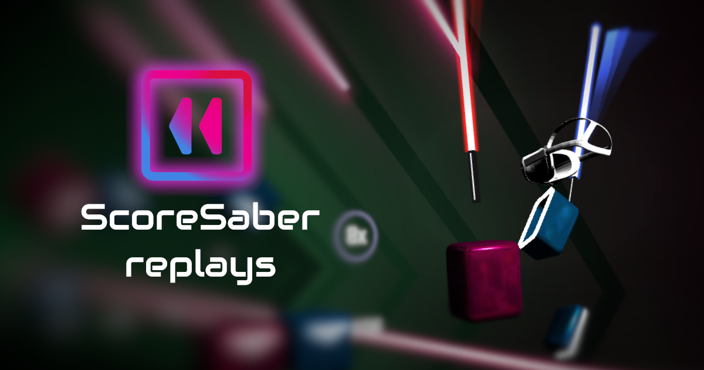

# BeatSaber Web Replays

[](https://app.netlify.com/sites/musing-aryabhata-6ae6ea/deploys)

[A-Frame]: https://github.com/radulov/ngoframe
[visit]: https://replay.beatleader.xyz/

Web-based viewer for BeatSaber replays, built with [A-Frame] and JavaScript.

**[CLICK TO VIEW][visit]**



## Usage

Go to the [BeatLeader](https://beatleader.xyz) and click on any ranked play higher than top 500 on leaderboard.

Or if you have a site, you can I-Frame the viewer and pass a query parameter
containing the song ID, difficulty and playerID:

`https://www.replay.beatleader.xyz/?id=c32d&difficulty=ExpertPlus&playerID=76561198333869741`

id - BeatSaver song ID. ("Ov Sacrament" in this case)
difficulty - Easy, Normal, Hard, Expert, ExpertPlus
playerID - player's Steam or Oculus ID (cerret in this case)

To directly link to a seeked time, use the `?time` parameter in the URL (milliseconds, int, 0 to song duration):

`https://www.replay.beatleader.xyz/?id=c32d&difficulty=ExpertPlus&playerID=76561198333869741&time=15000` - 15 sec

To specify replay speed use the `?speed` paramater in the URL (percent, int, 0 to 200):

`https://www.replay.beatleader.xyz/?id=c32d&difficulty=ExpertPlus&playerID=76561198333869741&speed=50` - 50% speed

To specify notes jump distance use the `?jd` paramater in the URL (meters, float, 5 to 50):

`https://www.replay.beatleader.xyz/?id=c32d&difficulty=ExpertPlus&playerID=76561198333869741&jd=18.6` - 18.6 JD

## Roadmap

- Performance optimization
- A-Frame update to the latest version
- Custom saber viewer

## Community

*The ScoreSaber replays is an unofficial community project and not officially
affiliated with Beat Saber.*

- [BeatLeader Discord](https://discord.gg/2RG5YVqtG6)

## Development

Built with [A-Frame](https://aframe.io), a web framework that we created for
building VR experiences. And JavaScript.

```
npm install
```

Uses [Open Replay Format](https://github.com/radulov/BS-Open-Replay)

### Configure Netlify account 

Create a new Netlify project and link it to the forked repo. 

#### Install netlify dev CLI

```bash
npm install netlify-cli -g
```

Then start Netlify dev environment

```bash
netlify dev
```

Navigate to [localhost:9999](http://localhost:9999). You should see app running.

#### A-Frame build

Uses custom A-Frame fork: https://github.com/radulov/ngoframe

To build it
```bash
npm install
npm run dist
```

Copy files from \dist folder of A-Frame to \vendor folder here. 

### Building and running in production mode

By default, Netlify builds the app after every change to this branch in the repository, so all you need is push to git.