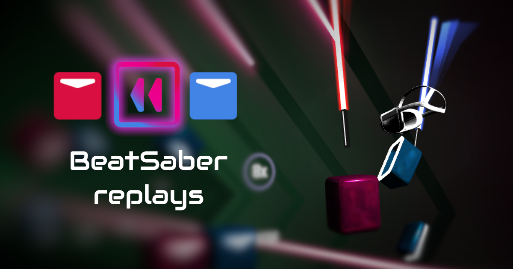

# Beat Saber Web Replays

[](https://app.netlify.com/sites/musing-aryabhata-6ae6ea/deploys)

[A-Frame]: https://github.com/nsgolova/ngoframe
[visit]: https://www.replay.beatleader.xyz/?id=c32d&difficulty=ExpertPlus&playerID=76561198333869741

Web-based viewer for Beat Saber replays, built with [A-Frame] and JavaScript.

**[CLICK TO VIEW][visit]**



## Community

- [BeatLeader Discord](https://discord.gg/2RG5YVqtG6)

*The Beat Saber Web Replays is an unofficial community project and not officially
affiliated with Beat Saber.*

## Usage

Go to the [BeatLeader](https://beatleader.xyz) and click on dancing pepe icon in the leaderboard.

Or if you have a site, you can I-Frame the viewer and pass a query parameter
containing the song ID, difficulty and playerID:

`https://www.replay.beatleader.xyz/?id=c32d&difficulty=ExpertPlus&playerID=76561198333869741`

id - BeatSaver song ID. ("Ov Sacrament" in this case)
difficulty - Easy, Normal, Hard, Expert, ExpertPlus
playerID - player's ScoreSaber or BeatLeader id (cerret in this case)

To directly link to a sought time, use the `?time` parameter in the URL (milliseconds, int, 0 to song duration):

`https://www.replay.beatleader.xyz/?id=c32d&difficulty=ExpertPlus&playerID=76561198333869741&time=15000` - 15 sec

To specify replay speed use the `?speed` parameter in the URL (percent, int, 0 to 200):

`https://www.replay.beatleader.xyz/?id=c32d&difficulty=ExpertPlus&playerID=76561198333869741&speed=50` - 50% speed

To specify notes jump distance use the `?jd` parameter in the URL (meters, float, 5 to 50):

`https://www.replay.beatleader.xyz/?id=c32d&difficulty=ExpertPlus&playerID=76561198333869741&jd=18.6` - 18.6 JD

To specify replay download link use the `?link` parameter in the URL. Make sure the link(name of the file) contains playerID:

`https://www.replay.beatleader.xyz/?link=https://cdn.discordapp.com/attachments/921820046345523314/934953493624660058/76561198059961776-Cheshires_dance-ExpertPlus-Standard-A2B943FE75E48394352B4FD912CEE8306788D0B1.dat`

It can also use BeatLeader's scoreId:

`https://www.replay.beatleader.xyz/?scoreId=442819`

## Development

Download repository.
The best way to download it is to use the "Clone" button in [SourceTree app](https://www.sourcetreeapp.com/)

Go to the project directory in the terminal and type.

```
npm install
```

If you don't have NodeJS - download it here: https://nodejs.org/en/ (LTS is recommended.) And repeat.

### Starting local build

Install netlify-cli(one time setup):
```bash
npm install netlify-cli -g
```

Start Netlify dev environment(every time):
```bash
netlify dev
```

Navigate to [localhost:9999](http://localhost:9999). You should see the app running.
Website will reload automatically after you save your changes.

### Contributing

- Create a fork ("Fork" button on top) or ask me in [Discord](https://discord.gg/2RG5YVqtG6) to add you to this repository as a developer if you plan to contribute often.
- Create work branch ("nsgolova/lightImprovements" for example). You can push to the master in your fork, but not in the main repository.
- Commit and push your changes.
- Open a pull request. Netlify will deploy a stage website for your fork and you can test it out.
- Your pull request would be merged and changes will deploy to the website!

### A-Frame build (optional)

This project uses a custom A-Frame fork: https://github.com/nsgolova/ngoframe
It's prebuilt and can be found in the \vendor folder.

To build it
```bash
npm install
npm run dist
```

Copy files from \dist folder of A-Frame to \vendor folder here. 

### Replay Format

Uses [Open Replay Format](https://github.com/BeatLeader/BS-Open-Replay)

### Building and running in production mode

By default, Netlify builds the app after every change to this branch in the repository, so all you need is push to git.

## Roadmap

- Settings UI improvement
- A-Frame update to the latest version
- Custom saber support